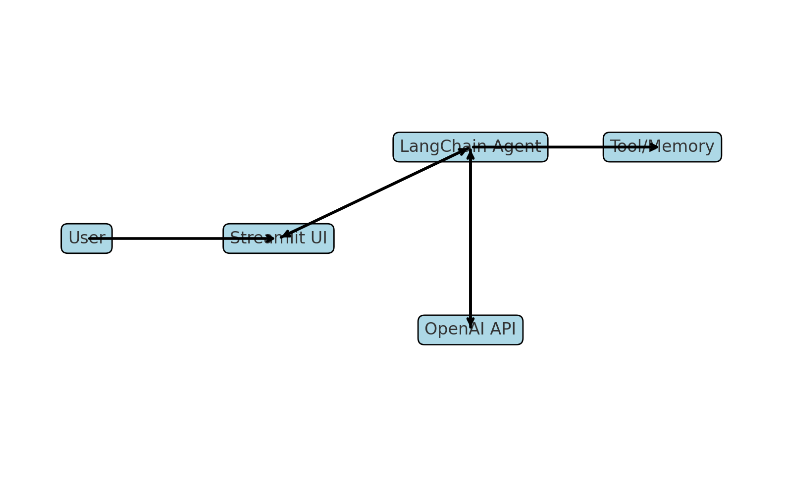

---

# 🤖 Conversational AI Agent with LangChain, Wikipedia Tools & Streamlit UI

A modular, memory-enabled conversational AI assistant using **LangChain**, **OpenAI GPT-3.5**, **Wikipedia tool calling**, and a user-friendly **Streamlit UI**. Built for scalable, context-aware conversations across industries.

---

## 💼 Business Scope

This assistant provides intelligent, tool-augmented interactions designed to automate enterprise support and information access. It enables:

* Seamless user-AI chat experiences
* Contextual memory across sessions
* Dynamic tool integration (e.g., Wikipedia search)

---

## 🔧 Real-World Applications

| Domain              | Use Case Description                                       |
| ------------------- | ---------------------------------------------------------- |
| Customer Support    | 24×7 AI helpdesk for issue resolution and FAQs             |
| Enterprise Helpdesk | Responds to internal HR, IT, onboarding, or policy queries |
| EdTech              | AI tutor for subject-specific support                      |
| Healthcare          | Health info triage and medical FAQ automation              |
| E-commerce          | Product search, delivery status, and recommendation        |
| Knowledge Mgmt      | Search and explain SOPs, guides, internal policies         |
| Legal/Compliance    | Answer legal FAQs, compliance rules, and policy docs       |
| HR & Recruitment    | Respond to job applications, hiring process, or screening  |
| Real Estate         | Inform users about listings, pricing, or eligibility       |

---

## 🌍 Why It Matters

✅ Reduces manual overhead
✅ Boosts productivity with 24/7 availability
✅ Increases engagement via natural, multi-turn dialogues
✅ Adaptable for tool-based and retrieval-augmented pipelines
✅ Works locally and in production deployments

---

## 🧠 Key Features

### ✅ LangChain Integration

* Uses `ChatOpenAI` + `ConversationBufferMemory`
* Maintains chat history for contextual replies
* Ready for integration with retrievers and multi-agent logic

### 🛠️ Tool Calling: Wikipedia Search

* Integrates LangChain tool calling
* Automatically queries Wikipedia if the assistant needs factual help
* Useful for historical, geographic, and scientific queries

---

## 🗂️ Project Structure

```
conversational-ai-agent/
├── streamlit_app/
│   ├── app.py                  # Streamlit interface
│   ├── langchain_agent.py      # LangChain agent + memory + tool logic
│   └── tools.py                # Wikipedia tool integration
├── .env                        # OpenAI API key (not committed to GitHub)
├── requirements.txt            # Dependencies
├── architecture_diagram.png    # System design visual
└── README.md                   # Documentation
```

---

## 🖼 Architecture Diagram



---

## ⚙️ Setup Instructions

### 1. Clone the Repository

```bash
git clone https://github.com/amitkharche/agents_agentic-chat-assistant.git
cd agents_agentic-chat-assistant
```

### 2. Create a Virtual Environment

```bash
python -m venv venv
# Activate on Windows
venv\Scripts\activate
# Or activate on Mac/Linux
source venv/bin/activate
```

### 3. Install Required Dependencies

```bash
pip install -r requirements.txt
```

### 4. Add Your OpenAI API Key

#### Option A: Using `.env` file (Recommended)

Create a `.env` file in the project root:

```
OPENAI_API_KEY=your_openai_api_key_here
```

#### Option B: Enter Manually in the App

If `.env` is missing, the app will prompt you to enter the key securely in the Streamlit UI.

---

## 🚀 Run the App

```bash
streamlit run streamlit_app/app.py
```

---

## 💡 Example Query

> **Q:** *What is the capital of India?*
> **A:** *The capital of India is New Delhi.* (Tool-invoked from Wikipedia)

---

## 🧪 Tech Stack

* 🧠 **OpenAI GPT-3.5 Turbo**
* 🧩 **LangChain (Agents + Tools + Memory)**
* 🌐 **Wikipedia Tool (LangChain community)**
* 💻 **Streamlit UI**
* 🔐 **.env API Management**

---

## 📬 Contact

* 🌐 [GitHub – amitkharche](https://github.com/amitkharche)
* 💼 [LinkedIn – amit-kharche](https://www.linkedin.com/in/amit-kharche)
* ✍️ [Medium – @amitkharche14](https://medium.com/@amitkharche14)

---
